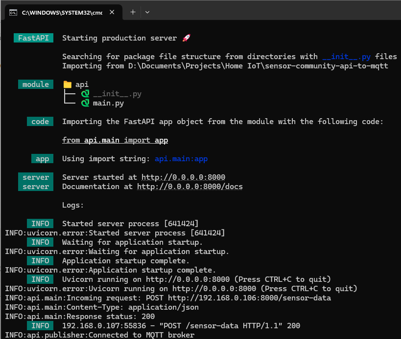
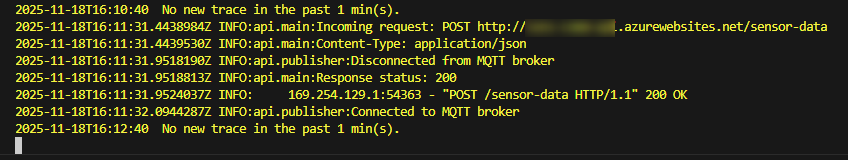
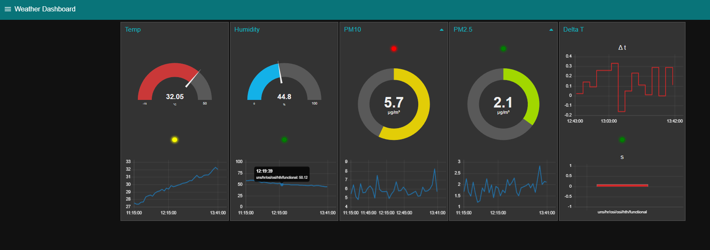

# Sensor Community self-hosted API bridge to MQTT broker

## Description 
Inspired by the incredible work of [Sensor.Community](https://sensor.community/en/) to make environmental data more trackable and transparent as well as [this similar project](https://github.com/jklmnn/airrohr-mqtt), I developed a simple self-hosted API accepting the data from an air sensor and sending it to a HiveMQ MQTT broker. Having the data in the cloud enables more complex scenarios such as real-time monitoring, triggers, etc. 

### Requirements
- Python >= v 3.11
- [FastAPI](https://fastapi.tiangolo.com/)
- [paho-mqtt Python client library](https://pypi.org/project/paho-mqtt/)

If starting from scratch, first go to the DIY guide [here](https://sensor.community/en/sensors/airrohr/) for how to set up your own sensor/s.

### Configurations

#### Custom API Configuration
The API is currently designed to run on a local machine on the same network as the sensor. Check your own IP and configure **Send data to custom API** accordingly:


#### MQTT Broker
Visit [HiveMQ](https://www.hivemq.com/) to sign up for a free cloud-based MQTT broker. 

#### Environment variables 
Running the API requires setting six environment variables. One way to do is to create an `.env` file in the `/api` directory. The file must contain:

- `API_USERNAME`="user name for logging in to the API"
- `API_PASSWORD`="password for logging in to the API"
- `MQTT_TOPIC`="uns/weather"
- `BROKER_HIVE`="your HiveMQ URL"
- `MQTT_USERNAME`="HiveMQ credentials user name"
- `MQTT_PASSWORD`="HiveMQ credentials password"
- `DB_SERVER`="azserver2025.database.windows.net"
- `DB_DATABASE`="MSSQLTips2025"
- `DB_USERNAME`="hhristov"
- `DB_PASSWORD`="£>630C8ZMRb."

#### Batch file (old version)
Modify the `api.bat` file by providing:
1. venv directory to reflect the virtual environment you want to use;
2. provide the path to the entry file `main.py`.

Then you can use the Windows task scheduler to run the .bat file every time you log in to Windows:


#### Running as container (new version)

##### on localhost 
- install Docker runtime
- run `docker build -f "Dockerfile" -t "sens-comm-api-mqtt:latest"`
- run `docker run -p 8000:8000 sens-comm-api-mqtt`

##### on Azure 
- create Azure Container Registry Service 
- run `az acr build --registry <ACR_NAME> --image sens-comm-api-mqtt` to push the image to ACR
- create a storage account `az storage account create -n mystorageaccount1234 -g <RESOURCE_GROUP> -l <LOCATION> --sku Standard_LRS`
- create a function app `az functionapp create --resource-group <RESOURCE_GROUP> --name <FUNC_NAME> --storage-account <STOR_ACC> --plan <APP_SERVICE_NAME> --image <ACR_NAME>/image_name:latest --assign-identity`
- set environment variables
- in case you need to update the existing deployment to use a new image version:
    - rebuild image 
        ```
        docker build -t sens-comm-api-mqtt:latest .
        ```
    - log in to Azure:
        ```
        az login
        az acr login --name <your_acr_name>
        ```
    - tag your updated local Docker image:
        ```
        docker tag sens-comm-api-mqtt:latest your_acr_name.azurecr.io/sens-comm-api-mqtt:latest
        ```
    - push the image to the registry:
        ```
        docker push your_acr_name.azurecr.io/sens-comm-api-mqtt:latest
        ```
    - update the Function App to use the refreshed image:
        ```    
        az functionapp config container set \
        --name sens-comm-api \
        --resource-group <rg_name> \
        --image <your_acr_name>.azurecr.io/sens-comm-api-mqtt:latest
        ```
    - restart the function
        ```
        az functionapp restart \
          --name sens-comm-api \
          --resource-group Sensor.Community

        ```

## Features
- one endpoint accepting the POST request with the payload from your IoT sensor controller. Once the FastAPI server is running you will be able to access the document at `localhost:8000/docs` (or wherever you deployed to):


If everything has been configured correctly:

- the console will show (*localhost version*):
    

- container logs (*containerized version*):
    

- the output will be visible in the HiveMQ cloud console:
    

## Notes 
You can check your current sensor payload from the latest measurement at `sensor-localhost/data.json`. I have included a sample in the `/models` subfolder. 


I have organized the project to allow scability and further expansion by, for instance, adding different models and different endpoints for different sensors. 

## Sample visualization 
Using NodeRed "MQTT in"


**Enjoy!**

## Change log
- 02.02.2026: added retain=True to better suit the data for agetn tool calling. 
- 18.11.2025: minor fixes to the data model, added data quality checks to the transfomer module and added the node red flow definition.
- 07.11.2025: containerized the API and added configuration for storing the data to an SQL database.
- 25.07.2025: fixed typos and added image of data visualization.
- 14.06.2025: initial commit.
- 13.06.2025: design, development and testing.
