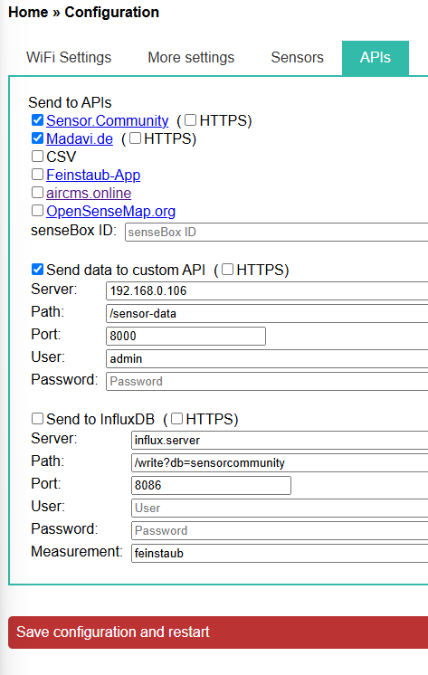
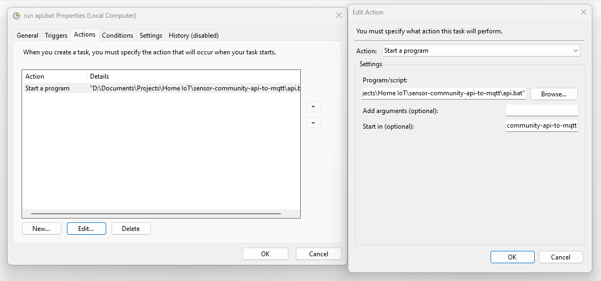
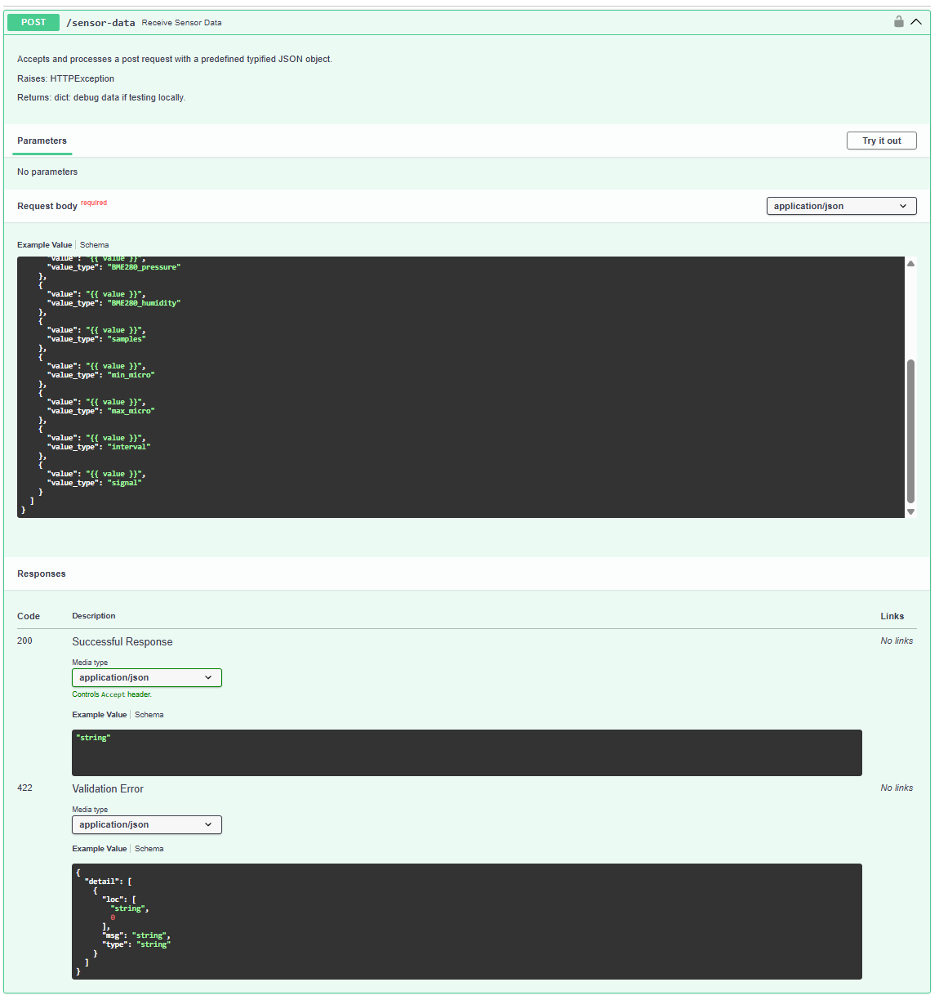
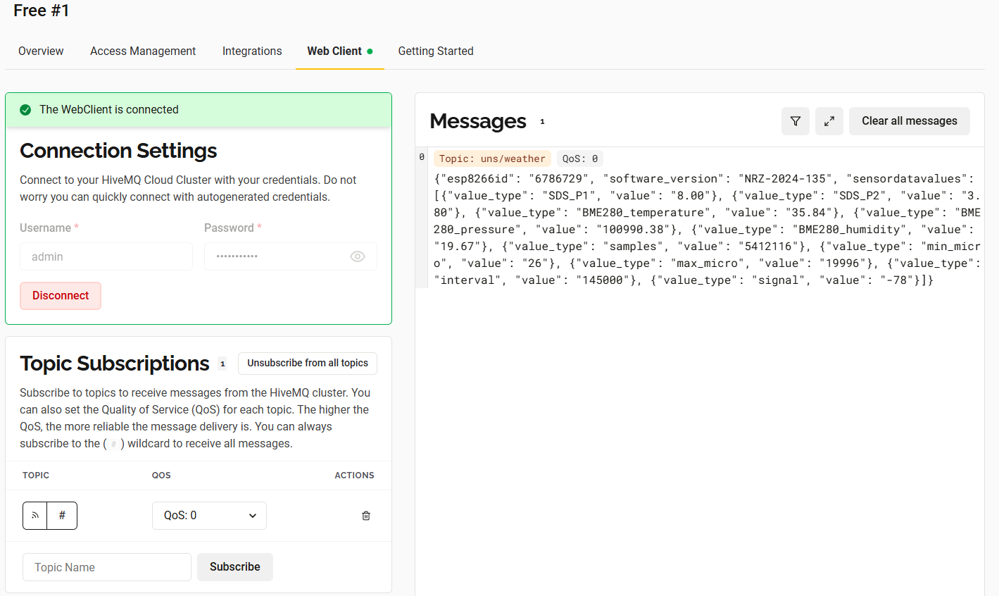
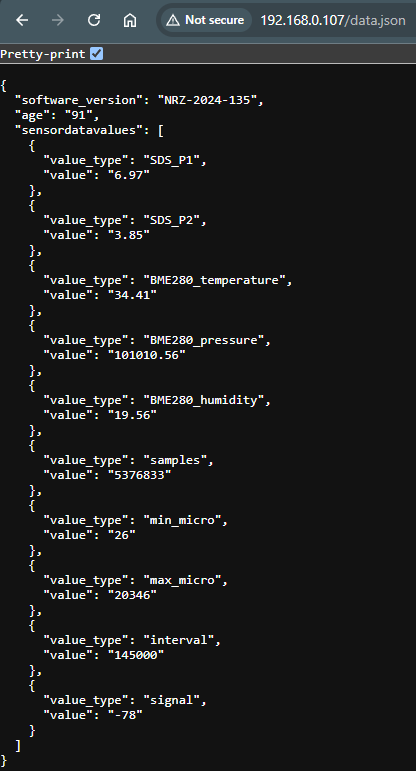

# Sensor Community self-hosted API bridge to MQTT broker

## Description 
Inspired by the incredible work of [Sensor.Community](https://sensor.community/en/) to make environmental data more trackable and transparent as well as [this similar project](https://github.com/jklmnn/airrohr-mqtt), I developed a simple self-hosted API accepting the data from an air sensor and sending it to a HiveMQ MQTT broker. Having the data in the cloud enables more complex scenarios such as real-time monitoring, triggers, etc. 

### Requirements
- Python >= v 3.11
- [FastAPI](https://fastapi.tiangolo.com/)
- [paho-mqtt Python client library](https://pypi.org/project/paho-mqtt/)

If starting from scratch, first go to the DIY guide [here](https://sensor.community/en/sensors/airrohr/) for how to set up your own sensor/s.

### Configurations

#### Custom API Configuration
The API is currently designed to run on a local machine on the same network as the sensor. Check your own IP and configure **Send data to custom API** accordingly:

#### MQTT Broker
Visit [HiveMQ](https://www.hivemq.com/) to sign up for a free cloud-based MQTT broker. 

#### Environment variables 
Running the API requires setting six environment variables. One way to do is to create an `.env` file in the `/api` directory. The file must contain:

- `API_USERNAME` = "user name for logging in to the API"
- `API_PASSWORD` = "password for logging in to the API"
- `MQTT_TOPIC`="uns/weather"
- `BROKER_HIV`E="your HiveMQ URL"
- `MQTT_USERNAME`="HiveMQ credentials user name"
- `MQTT_PASSWORD`="HiveMQ credentials password"

#### Batch file
Modify the `api.bat` file by providing:
1. venv directory to reflect the virtual environment you want to use;
2. provide the path to the entry file `main.py`.

Then you can use the Windows task scheduler to run the .bat file every time you log in to Windows:

## Features
- one endpoint accepting the POST request with the payload from your sensor. Once the FastAPI server is running you will be able to access the document at `localhost:8000/docs`:

If everything has been configured correctly:
- the console will show:
    
- the output will be visible in the HiveMQ cloud console:
    

## Notes 
You can check your current sensor payload from the latest measurement at `sensor-localhost/data.json`. I have included a sample in the `/models` subfolder. 

I have organized the project to allow scability and further expansion by, for instance, adding different models and different endpoints for different sensors. 

**Enjoy!**

## Change logs
- 13.06.2025: design and testing
- 14.06.2025: initial commit.
